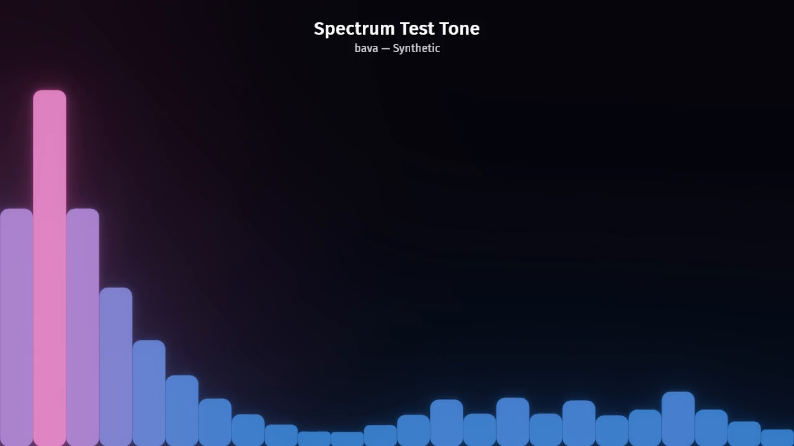

# bava

A music visualizer built with [Bevy](https://bevyengine.org/) and a Rust port of
[CAVA's analysis engine](https://github.com/karlstav/cava). It captures playing
audio and draws its frequency spectrum, with track info and album art from the
OS media session.

| Platform | Audio capture | Now-playing |
|---|---|---|
| Linux | Native PipeWire monitor (default; PulseAudio fallback) | MPRIS over D-Bus |
| Windows | WASAPI shared-mode loopback | GlobalSystemMediaTransportControls (GSMTC) |
| macOS 14.2+ | Core Audio process tap (no extra install) | MediaRemote adapter |
| Web (Chrome) | Tab share via `getDisplayMedia` | YouTube IFrame API + thumbnail |

[Try it in Chrome or Chromium](https://dekuraan.github.io/bava/). Share a tab
to visualize its audio.



## Install

Download a `.deb`, `.rpm`, `.AppImage`, or a binary for Linux, Windows, or macOS
from the [releases page](https://github.com/dekuraan/bava/releases).

```sh
# Debian/Ubuntu
sudo apt install ./bava_*.deb

# Fedora/RHEL
sudo dnf install ./bava-*.rpm

# Anything else (no install, no root)
chmod +x bava-*.AppImage && ./bava-*.AppImage

# Flatpak bundle from the release assets
flatpak install --user ./bava-0.4.1-x86_64.flatpak
flatpak run io.github.dekuraan.bava

# Nix
nix run github:dekuraan/bava
```

The AppImage, `.deb`, and `.rpm` use the PulseAudio-only build for compatibility
with older distributions. They also work on PipeWire hosts through pipewire-pulse.

Building from source is [below](#build--run).

### Not yet published

The AUR, Flathub, and Snap manifests are in the repository, but the packages
are not published yet. These commands will work after publication.
See [packaging status](packaging/README.md) for the remaining work.

```sh
paru -S bava                                          # AUR (or bava-git for HEAD)
flatpak install flathub io.github.dekuraan.bava       # Flathub
sudo snap install bava && sudo snap connect bava:audio-record
```

## Features

- Cycle through 11 modes with Space. Bars, Levels, Particles, Spine, and Wave
  each have box and circle variants; Splitter is box-only. Customize colors,
  mirror and direction settings, and HDR bloom.
- Spawn physics balls that collide with the spectrum and leave color trails.
  Physics uses avian2d.
- Press `p` to open the settings editor. Visual changes apply immediately;
  DSP changes require Apply. The editor key is configurable.
- Show the track title, artist, and cover art, with the cover as a dimmed
  backdrop. The previous cover stays for up to five seconds while new art
  loads. Adjust `[vis] album_art_linger` from 0 to 60 seconds, or use
  "cover linger (s)" in the editor. Set it to `0` to clear missing art immediately.
- Save settings in `~/.config/bava/config.toml`, created on first run.
  Named profiles live in `~/.config/bava/profiles/`; load one with
  `--profile NAME`. CLI flags override file values.
- Render an audio file to video with `--input song.mp3 --out video.mp4`.
  Output uses H.264 high, yuv420p, AAC at 384 kbps, and faststart.

## In the browser

The [web app](https://dekuraan.github.io/bava/) runs through WebAssembly and
includes a YouTube player. Choose "Start visualizing" to share the tab's audio
and play the video. "Capture another tab" lets you use audio from sites such as
Spotify Web or Bandcamp. "Play a file" opens a local audio file without a
screen-share prompt. You can also [open the file player directly](https://dekuraan.github.io/bava/?source=file).

```sh
trunk serve --cargo-profile web-dev   # http://localhost:8080
trunk build --release                 # → dist/, static files for any host
```

Use `web-dev` for local development. The default `dev` profile leaves bava's
per-frame code at `opt-level = 0`, and debug info pushes the module past 100 MB.
The browser must load it on every reload. `web-dev` is about 61 MB;
`--release` is about 34 MB, or 12 MB gzipped.

Use Chrome or Chromium and tick "Also share tab audio" in the share picker.
Window and whole-screen shares carry no audio outside Windows. All visualizer
modes, physics balls, dynamic album colors, and the settings editor work in the
browser. Settings persist in `localStorage`. The query string accepts the same
flags as the CLI, for example `?bars=48&mode=wave-circle`.
See [docs/WEB.md](docs/WEB.md).

## Rendering a music video

```sh
bava --input song.mp3 --out musicvideo.mp4          # 1080p60 by default
bava --input song.flac --out out.mp4 --width 3840 --height 2160 --fps 60
bava --input song.mp3 --out test.mp4 --duration 10  # quick 10-second preview
```

Requires `ffmpeg` on `PATH` to encode the rendered frames and audio. Supported
inputs include MP3, FLAC, Ogg/Vorbis, WAV, and M4A/AAC, decoded with symphonia.
Track tags supply the now-playing HUD, and embedded cover art supplies the
dynamic color palette.

When launched from a terminal, bava opens a preview window. Press Space to
cycle modes or click to add physics balls to the recording. When stdout isn't
a terminal, bava records without a window. Set `--headless` or
`--headless=false` to choose explicitly. Each frame advances time by a fixed
step, so audio and video stay in sync regardless of render speed.

## Build & run

Requires [Rust stable](https://rustup.rs/) 1.95 or newer for Bevy 0.19. bava is
pure Rust and does not require a C toolchain or FFTW.

### Linux

```sh
# Arch/CachyOS
sudo pacman -S pipewire libpulse dbus libxkbcommon wayland libx11 vulkan-icd-loader

cargo run -p bava
# If the shell lacks a Wayland socket: WAYLAND_DISPLAY=wayland-1 cargo run -p bava
# Pure-PulseAudio host (no libpipewire link): cargo run -p bava --no-default-features
```

### Windows

```sh
cargo build --release -p bava
```

### macOS (14.2+)

```sh
# The mediaremote-adapter is required for now-playing metadata. Install it and
# set BAVA_MEDIAREMOTE_ADAPTER_DIR to its directory before running:
# https://github.com/ungive/mediaremote-adapter
export BAVA_MEDIAREMOTE_ADAPTER_DIR=/path/to/adapter
cargo run -p bava
```

On first launch, grant Audio Recording permission for the Core Audio process
tap. Without it, the app runs but cannot capture audio.

### Tests

```sh
cargo test -p cavacore-rs        # DSP safety and correctness suite
cargo test -p bava --bin bava    # app unit/system/physics tests (headless)
cargo fmt --all --check          # gated in CI
cargo clippy --workspace --all-targets -- -D warnings
```

### Profiling

`--features profile` sends Bevy's per-system `tracing` spans to
[puffin](https://github.com/EmbarkStudios/puffin). Use the `profiling` cargo
profile for measurements. The `dev` profile leaves bava's code unoptimized.

```sh
cargo run -p bava --profile profiling --features profile
puffin_viewer --url 127.0.0.1:8585                        # attach to it

# No display / over ssh: print an aggregated self-time table every N frames.
BAVA_PROFILE_REPORT=600 cargo run -p bava --profile profiling --features profile
```

Compositor pacing can hide performance differences between frames that finish
within one refresh interval. For A/B measurements, use offline rendering with
`--input song.mp3 --out video.mp4 --duration 5 --headless`. This renders a fixed
number of frames without display pacing.

## Workspace layout

```
crates/
  cavacore-rs/         # Rust cavacore port using realfft; DSP tests
  bava/
    src/cava/          # CavaPlugin, Cava resource, capture thread, feed_cava system
    src/cava/capture/  # AudioCapture trait; backends: pipewire.rs / pulse.rs / wasapi.rs / coreaudio.rs / web.rs
    src/now_playing/   # NowPlaying + AlbumArt resources; backends: linux / windows / macos / web
    src/vis/           # VisPlugin: all visualizer modes, HUD, physics, stroke mesh helpers
    src/gui/           # in-app settings editor (bevy_egui)
    src/record/        # offline --input/--out rendering: decode, drive, ffmpeg encoder
    src/config.rs      # config.toml ↔ runtime *Settings resources; CLI via clap
    src/profiling.rs   # puffin bridge, behind --features profile
    web/               # the browser page: index.html, bava.js, audio-worklet.js, style.css
docs/                  # WEB.md and the generated screenshot
packaging/             # icons, AUR, AppImage, Nix, web assets; see packaging/README.md
flatpak/  snap/        # Flathub manifest and snapcraft.yaml
```

## Key bindings

| Key | Action |
|---|---|
| Space | Cycle visualizer mode |
| p | Toggle settings editor (configurable via `[gui] toggle_key`) |
| F3 | Collider debug overlay + FPS and live ball count |
| Left-click | Spawn one physics ball |
| Right-click (hold) | Spray a burst of balls |

Physics is active on the Bars/Levels and Wave box modes and every circle mode;
other shapes ignore clicks. `--spawn-balls N` drops N balls on the first frame.

## Extending

Every visualizer reads the same `Cava` resource:

```rust
fn my_vis(cava: Res<bava::cava::Cava>) {
    let mono  = cava.mono();   // &[f32]  average of left+right
    let left  = cava.left();   // &[f32]  left channel
    let right = cava.right();  // &[f32]  right channel (empty in mono mode)
    // drive meshes, transforms, materials, or shader uniforms from these
}
```

To add a visualizer, create its entities and a system that reads `Cava`.
See the existing modes in `vis/` for examples.

## License

bava is available under the [MIT License](LICENSE-MIT) or
[Apache License, Version 2.0](LICENSE-APACHE), at your option.

The `cavacore-rs` crate is a pure-Rust reimplementation of the analysis engine
from [karlstav/cava](https://github.com/karlstav/cava), under the MIT license.
It uses [`realfft`](https://crates.io/crates/realfft) and does not link C or FFTW.
